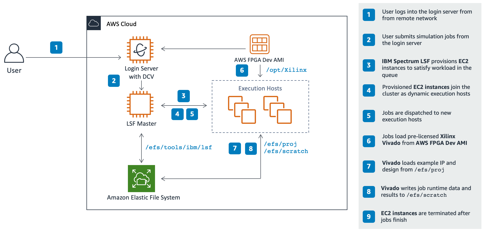

# Run Example Simulation Workload

## Overview

This tutorial provides instructions for running an example logic simulation workload in the EDA computing environment created in the [deployment tutorial](deploy-simple.md) included in this workshop.  The example workload uses example designs and IP contained in the public **AWS F1 FPGA Development Kit** and the **Xilinx Vivado** EDA software suite provided by the **AWS FPGA Developer AMI** that you subscribed to in the first tutorial. Although you'll be using data and tools from AWS FPGA developer resources, you will not be running on the F1 FPGA instance or executing any type of FPGA workload; we're simply running software simulations on EC2 compute instances using the design data, IP, and EDA tools and flows that these kits provide.

**Note** There is are no additional charges to use the **AWS F1 FPGA Development Kit** or the  **Xilinx Vivado** tools in the **AWS FPGA Developer AMI**.  You are only charged for the underlying AWS resources consumed by running the AMI and included software.

### Workflow



### Step 1. Clone the AWS F1 FPGA Development Kit repo
This repo contains example design data, IP, and a simple workflow to execute verification tests at scale.

1. From the DCV remote desktop session that you established in the previous module, clone the example workload from the `aws-fpga-sa-demo` Github repo into the `proj` directory on the NFS file system. The default location is `/efs/proj`.

   ```bash
   cd /efs/proj
   git clone https://github.com/morrmt/aws-fpga-sa-demo.git
   ```

1. Change into the repo's workshop directory

    `cd /efs/proj/aws-fpga-sa-demo/eda-workshop`

### Step 2. Run build job

This first job will set up the runtime environment for the simulations that you will submit to LSF in Step 3 below.

1. Run the `bhosts` command. Notice that the LSF master is the only host in the cluster.
1. **Submit the setup job into LSF**. The `--scratch-dir` should be the path to the scratch directory you defined when launching the CloudFormation stack in the previous tutorial.  The default is `/efs/scratch`.

   `bsub -R aws -J "setup" ./run-sim.sh --scratch-dir /efs/scratch`

1. **Watch job status**. This job will generate demand to LSF Resource Connector for an EC2 instance.  Shortly after you submit the job, you should see a new "LSF Exec Host" instance in the EC2 Dashboard in the AWS console. It should take 2-5 minutes for this new instance to join the cluster and accept the job. Use the `bjobs` command to watch the status of the job.  Once it enters the `RUN` state, move on to the next step.

### Step 3. Run verification tests at scale

Now we are ready to scale out the simulations.  Like with the build job above, when these jobs hit the queue LSF will generate demand for EC2 instances, and Resource Connector will start up the appropriate number and type of instances to satisfy the pending jobs in the queue.

1. Run the `bhosts` command.  You should see two hosts now -- the LSF master and the execution host for the setup job.
1. **Submit a large job array**. This job array will spawn 100 verification jobs.  These jobs use a dependency condition so that they will be dispatched only after the build job above completes successfully. The build job run time is about 15 minutes.

   `bsub -R aws -J "regress[1-100]" -w "done(setup)" ./run-sim.sh --scratch-dir /efs/scratch`

1. Check job status

    `bjobs -A`

1. Check execution host status

    `bhosts -w`

1. Check cluster status

   `badmin showstatus`

About 5 minutes after the jobs complete, LSF Resource Connector will begin terminating the idle EC2 instances.
